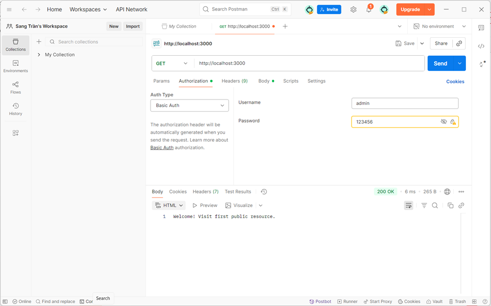
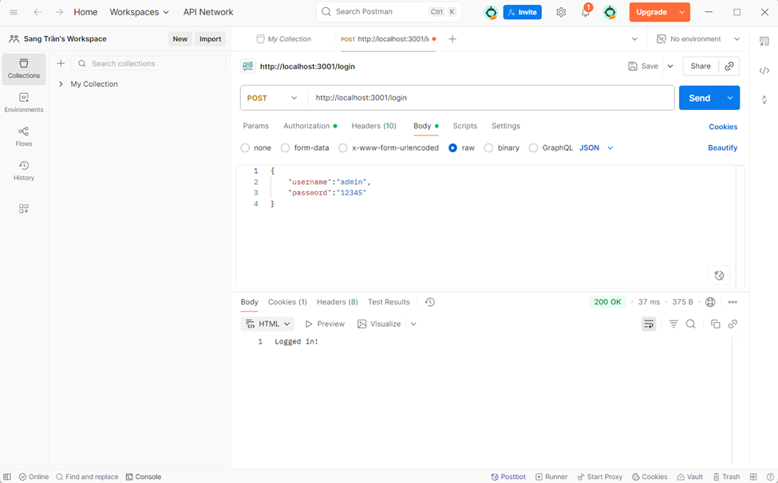
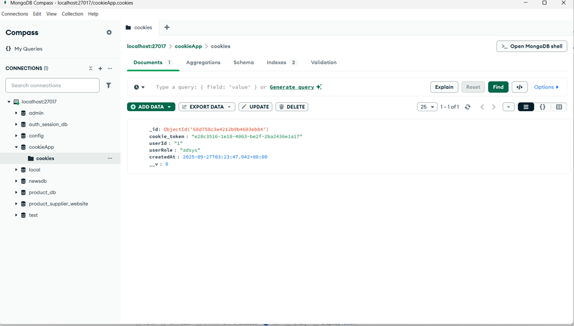

# Simple Authentication Examples

This directory contains examples of different authentication methods in Express.js applications.

## 📁 Project Structure

```
src/simple_auth/
├── basic_auth.js      # HTTP Basic Authentication
├── cookie_auth.js     # Cookie-based Authentication  
└── README.md          # This file
```

## 🔐 Authentication Methods

### 1. Basic Authentication (`basic_auth.js`)

Simple HTTP Basic Authentication using hardcoded credentials.

#### Features:
- ✅ Username/password authentication
- ✅ Protected routes
- ✅ Authorization header validation
- ✅ No database required

#### Credentials:
- **Username**: `admin`
- **Password**: `12345`

#### Routes:
| Route | Method | Protection | Description |
|-------|--------|------------|-------------|
| `/` | GET | Public | Welcome page |
| `/public` | GET | Public | Public resource |
| `/secure` | GET | Protected | Requires authentication |

### 2. Cookie Authentication (`cookie_auth.js`)

Session-based authentication using cookies and MongoDB storage.

#### Features:
- ✅ Login/logout functionality
- ✅ Cookie-based sessions
- ✅ MongoDB session storage
- ✅ Auto-expiring sessions (5 minutes)
- ✅ Secure cookie handling

#### Credentials:
- **Username**: `admin`
- **Password**: `12345`
- **Role**: `adsys`

#### Routes:
| Route | Method | Protection | Description |
|-------|--------|------------|-------------|
| `/login` | POST | Public | User login |
| `/profile` | GET | Protected | User profile (requires cookie) |
| `/logout` | POST | Public | User logout |

## 🚀 Setup & Installation

### Prerequisites:
```bash
# Make sure you have Node.js and MongoDB installed
node --version
mongod --version
```

### Install Dependencies:
```bash
npm install express mongoose cookie-parser crypto
```

### Start MongoDB:
```bash
# Windows
mongod

# macOS/Linux
sudo mongod
```

## 🧪 Testing

### Basic Authentication Example

#### 1. Start Server:
```bash
node basic_auth.js
```

#### 2. Test with curl:
```bash
# Public routes (no auth required)
curl http://localhost:3000/
curl http://localhost:3000/public

# Protected route (will fail)
curl http://localhost:3000/secure

# Protected route (with auth)
curl -u admin:12345 http://localhost:3000/secure
```

#### 3. Test with Postman:
- **URL**: `GET http://localhost:3000/secure`
- **Authorization Tab**: 
  - Type: `Basic Auth`
  - Username: `admin`
  - Password: `12345`

### Cookie Authentication Example

#### 1. Start Server:
```bash
node cookie_auth.js
```

#### 2. Test with curl:
```bash
# Login (get cookie)
curl -X POST http://localhost:3001/login \
  -H "Content-Type: application/json" \
  -d '{"username":"admin","password":"12345"}' \
  -c cookies.txt

# Access protected route (use cookie)
curl http://localhost:3001/profile -b cookies.txt

# Logout (clear cookie)
curl -X POST http://localhost:3001/logout -b cookies.txt
```

#### 3. Test with Postman:

**Step 1: Login**
- **Method**: `POST`
- **URL**: `http://localhost:3001/login`
- **Headers**: `Content-Type: application/json`
- **Body** (raw JSON):
```json
{
    "username": "admin", 
    "password": "12345"
}
```

**Step 2: Access Profile**
- **Method**: `GET`
- **URL**: `http://localhost:3001/profile`
- Cookie will be automatically sent by Postman

**Step 3: Logout**
- **Method**: `POST`
- **URL**: `http://localhost:3001/logout`

## 📊 Expected Responses

### Basic Auth Responses:

| Request | Status | Response |
|---------|--------|----------|
| `GET /` | 200 | "Welcome! Visit first public resource." |
| `GET /public` | 200 | "Welcome! Visit second public resource." |
| `GET /secure` (no auth) | 401 | "Authentication required." |
| `GET /secure` (wrong auth) | 403 | "Access denied." |
| `GET /secure` (correct auth) | 200 | "You have accessed a protected resource 🎉" |

### Cookie Auth Responses:

| Request | Status | Response |
|---------|--------|----------|
| `POST /login` (valid) | 200 | "Logged in!" |
| `POST /login` (invalid) | 401 | "Invalid credentials" |
| `GET /profile` (no cookie) | 401 | "No cookie found" |
| `GET /profile` (expired) | 401 | "Invalid or expired cookie" |
| `GET /profile` (valid) | 200 | "Welcome user 1, your cookie is valid." |
| `POST /logout` | 200 | "Logged out." |

## 🔧 Configuration

### Basic Auth Configuration:
```javascript
// Hardcoded credentials (basic_auth.js)
const USERNAME = "admin";
const PASSWORD = "12345";
```

### Cookie Auth Configuration:
```javascript
// Database connection (cookie_auth.js)
mongoose.connect("mongodb://127.0.0.1:27017/cookieApp")

// Cookie expiration (5 minutes)
expires: 60 * 5

// Cookie options
res.cookie("auth_cookie_token", cookie_token, { 
    httpOnly: true, 
    maxAge: 1000 * 60 * 5 
});
```

## 🛡️ Security Features

### Basic Authentication:
- ✅ Base64 encoding of credentials
- ✅ WWW-Authenticate header
- ✅ Protected route middleware
- ⚠️ Credentials sent with every request
- ⚠️ No session management

### Cookie Authentication:
- ✅ Secure HTTP-only cookies
- ✅ Session storage in database
- ✅ Automatic session expiration
- ✅ UUID-based session tokens
- ✅ Cookie clearing on logout

## 📝 Notes

### Basic Auth:
- Simple implementation for testing/prototyping
- Not recommended for production without HTTPS
- Credentials must be sent with every request
- No logout functionality (stateless)

### Cookie Auth:
- More secure for web applications
- Supports proper login/logout flow
- Requires database for session storage
- Better user experience (automatic cookie handling)

## 🚀 Next Steps

Consider implementing more advanced authentication:
- JWT (JSON Web Tokens)
- OAuth 2.0 / OpenID Connect
- Passport.js integration
- Password hashing (bcrypt)
- Rate limiting
- CSRF protection

## 🐛 Troubleshooting

### Common Issues:

1. **MongoDB Connection Error**:
   ```bash
   # Make sure MongoDB is running
   mongod --version
   # Check if port 27017 is available
   ```

2. **Cookie Not Working**:
   - Check if `cookie-parser` middleware is installed
   - Verify cookie settings in browser developer tools

3. **Port Already in Use**:
   ```bash
   # Find process using port
   netstat -ano | findstr :3000
   # Kill process if needed
   taskkill /PID <process_id> /F
   ```

4. **CORS Issues** (if testing from browser):
   ```javascript
   // Add CORS middleware if needed
   app.use((req, res, next) => {
       res.header('Access-Control-Allow-Origin', '*');
       res.header('Access-Control-Allow-Headers', 'Origin, X-Requested-With, Content-Type, Accept, Authorization');
       next();
   });
   ```

## 📚 Learning Resources

- [Express.js Authentication Guide](https://expressjs.com/en/guide/error-handling.html)
- [HTTP Authentication: Basic and Digest Access Authentication](https://tools.ietf.org/html/rfc2617)
- [HTTP Cookies Explained](https://developer.mozilla.org/en-US/docs/Web/HTTP/Cookies)
- [Session Management Best Practices](https://cheatsheetseries.owasp.org/cheatsheets/Session_Management_Cheat_Sheet.html)

## 🎯 Production Considerations

Before using in production:

1. **Use HTTPS** - Never send credentials over HTTP
2. **Hash passwords** - Use bcrypt or similar
3. **Implement rate limiting** - Prevent brute force attacks
4. **Add input validation** - Sanitize all inputs
5. **Use environment variables** - Don't hardcode credentials
6. **Add logging** - Monitor authentication attempts
7. **Implement CSRF protection** - For cookie-based auth

## 📄 License

This code is for educational purposes only. Use at your own risk in production environments.

## Image Test




